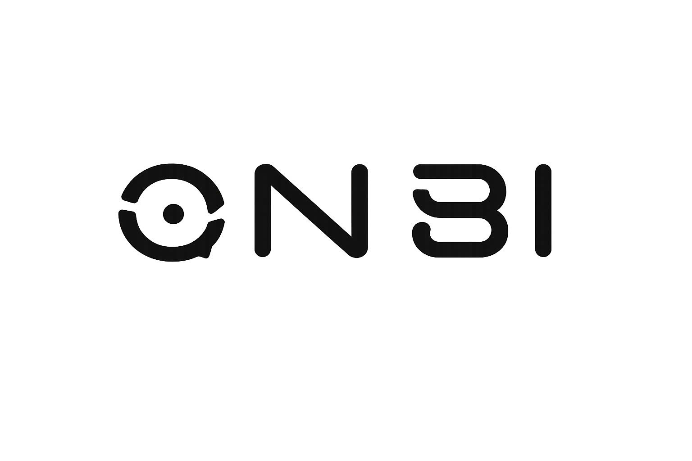

<a id="readme-top"></a>

<!-- PROJECT LOGO -->
<br />
<div align="center">
  <a href="https://github.com/github_username/fe-onbi">
    
  </a>

<h3 align="center">FE-Onbi</h3>

  <p align="center">
    A premium EdTech frontend for ONBI, featuring a modern Apple-style landing page with dark mode and 3D interactions.
    <br />
    <a href="https://github.com/github_username/fe-onbi"><strong>Explore the docs »</strong></a>
    <br />
    <br />
    <a href="https://github.com/github_username/fe-onbi">View Demo</a>
    ·
    <a href="https://github.com/github_username/fe-onbi/issues">Report Bug</a>
    ·
    <a href="https://github.com/github_username/fe-onbi/issues">Request Feature</a>
  </p>
</div>

<!-- TABLE OF CONTENTS -->
<details>
  <summary>Table of Contents</summary>
  <ol>
    <li>
      <a href="#about-the-project">About The Project</a>
      <ul>
        <li><a href="#built-with">Built With</a></li>
      </ul>
    </li>
    <li>
      <a href="#getting-started">Getting Started</a>
      <ul>
        <li><a href="#prerequisites">Prerequisites</a></li>
        <li><a href="#installation">Installation</a></li>
      </ul>
    </li>
    <li><a href="#usage">Usage</a></li>
    <li><a href="#roadmap">Roadmap</a></li>
    <li><a href="#contributing">Contributing</a></li>
    <li><a href="#license">License</a></li>
    <li><a href="#contact">Contact</a></li>
    <li><a href="#acknowledgments">Acknowledgments</a></li>
  </ol>
</details>

<!-- ABOUT THE PROJECT -->
## About The Project

FE-Onbi is the frontend application for the ONBI project, designed as a premium landing page and web application. It features a modern, Apple-inspired design aesthetic, seamless light/dark mode transitions, and interactive 3D components.

<p align="right">(<a href="#readme-top">back to top</a>)</p>

### Built With

* [![Next][Next.js]][Next-url]
* [![React][React.js]][React-url]
* [![TailwindCSS][TailwindCSS.com]][TailwindCSS-url]
* [![Threejs][Three.js]][Three-url]

<p align="right">(<a href="#readme-top">back to top</a>)</p>

<!-- GETTING STARTED -->
## Getting Started

To get a local copy up and running follow these simple example steps.

### Prerequisites

* npm
  ```sh
  npm install npm@latest -g
  ```

### Installation

1. Clone the repo
   ```sh
   git clone https://github.com/github_username/fe-onbi.git
   ```
2. Install NPM packages
   ```sh
   npm install
   ```
3. Start the development server
   ```sh
   npm run dev
   ```

<p align="right">(<a href="#readme-top">back to top</a>)</p>

<!-- USAGE EXAMPLES -->
## Usage

This project serves as the main web interface for ONBI. It includes responsive landing pages, feature showcases, and a seamless pricing/checkout flow preview.

<p align="right">(<a href="#readme-top">back to top</a>)</p>

<!-- ROADMAP -->
## Roadmap

- [x] Initial Landing Page Setup
- [x] Apple-style Light/Dark Theme Integration
- [x] Circle Reveal Transitions
- [x] Pricing Section Redesign
- [ ] Authentication Integration
- [ ] Dashboard View

See the [open issues](https://github.com/github_username/fe-onbi/issues) for a full list of proposed features (and known issues).

<p align="right">(<a href="#readme-top">back to top</a>)</p>

<!-- CONTRIBUTING -->
## Contributing

Contributions are what make the open source community such an amazing place to learn, inspire, and create. Any contributions you make are **greatly appreciated**.

If you have a suggestion that would make this better, please fork the repo and create a pull request. You can also simply open an issue with the tag "enhancement".
Don't forget to give the project a star! Thanks again!

1. Fork the Project
2. Create your Feature Branch (`git checkout -b feature/AmazingFeature`)
3. Commit your Changes (`git commit -m 'Add some AmazingFeature'`)
4. Push to the Branch (`git push origin feature/AmazingFeature`)
5. Open a Pull Request

<p align="right">(<a href="#readme-top">back to top</a>)</p>

<!-- LICENSE -->
## License

Distributed under the MIT License. See `LICENSE.txt` for more information.

<p align="right">(<a href="#readme-top">back to top</a>)</p>

<!-- CONTACT -->
## Contact

Project Link: [https://github.com/github_username/fe-onbi](https://github.com/github_username/fe-onbi)

<p align="right">(<a href="#readme-top">back to top</a>)</p>

<!-- ACKNOWLEDGMENTS -->
## Acknowledgments

* [Next.js Documentation](https://nextjs.org/docs)
* [Tailwind CSS Documentation](https://tailwindcss.com/docs)
* [React Three Fiber](https://docs.pmnd.rs/react-three-fiber)

<p align="right">(<a href="#readme-top">back to top</a>)</p>


<!-- MARKDOWN LINKS & IMAGES -->
<!-- https://www.markdownguide.org/basic-syntax/#reference-style-links -->
[contributors-shield]: https://img.shields.io/github/contributors/github_username/fe-onbi.svg?style=for-the-badge
[contributors-url]: https://github.com/github_username/fe-onbi/graphs/contributors
[forks-shield]: https://img.shields.io/github/forks/github_username/fe-onbi.svg?style=for-the-badge
[forks-url]: https://github.com/github_username/fe-onbi/network/members
[stars-shield]: https://img.shields.io/github/stars/github_username/fe-onbi.svg?style=for-the-badge
[stars-url]: https://github.com/github_username/fe-onbi/stargazers
[issues-shield]: https://img.shields.io/github/issues/github_username/fe-onbi.svg?style=for-the-badge
[issues-url]: https://github.com/github_username/fe-onbi/issues
[license-shield]: https://img.shields.io/github/license/github_username/fe-onbi.svg?style=for-the-badge
[license-url]: https://github.com/github_username/fe-onbi/blob/master/LICENSE.txt
[linkedin-shield]: https://img.shields.io/badge/-LinkedIn-black.svg?style=for-the-badge&logo=linkedin&colorB=555
[linkedin-url]: https://linkedin.com/in/linkedin_username
[product-screenshot]: images/screenshot.png
[Next.js]: https://img.shields.io/badge/next.js-000000?style=for-the-badge&logo=nextdotjs&logoColor=white
[Next-url]: https://nextjs.org/
[React.js]: https://img.shields.io/badge/React-20232A?style=for-the-badge&logo=react&logoColor=61DAFB
[React-url]: https://reactjs.org/
[TailwindCSS.com]: https://img.shields.io/badge/Tailwind_CSS-38B2AC?style=for-the-badge&logo=tailwind-css&logoColor=white
[TailwindCSS-url]: https://tailwindcss.com
[Three.js]: https://img.shields.io/badge/threejs-black?style=for-the-badge&logo=three.js&logoColor=white
[Three-url]: https://threejs.org/
